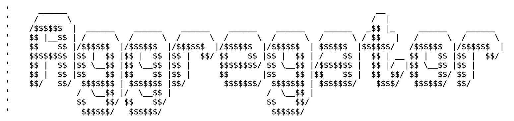

<div align="center">



Real-time monitoring tool for tracking blockchain data indexation latency across multiple aggregators.

**[Latency - Benchmark - Live Dashboard](https://aggregator-latency-track.fly.dev/)**

</div>

## How It Works

The monitor connects to aggregator WebSocket feeds and measures latency by comparing:
- When a trade occurs on-chain (from the event timestamp)
- When the aggregator pushes the event via WebSocket (current time)

Metrics are exposed via Prometheus and visualized in Grafana dashboards.

**Tracked Aggregators**: CoinGecko, Mobula, Codex
**Supported Chains**: Solana, BNB Chain, Base, Monad

## Quick Start

### Prerequisites

- Go 1.24+
- Docker & Docker Compose
- API keys from aggregators you want to track

### Run

```bash
# Clone the repository
git clone <repo-url>
cd aggregator_latency_track

# Create .env file with your API keys (see Environment Variables below)
cp .env.example .env
# Edit .env with your keys

# Start everything
make run
```

This command will:
1. Build the Go binary
2. Start Prometheus and Grafana
3. Launch the latency monitor
4. Display metrics in real-time

### Access Dashboards

- **Grafana**: http://localhost:3000 (admin/admin)
- **Prometheus**: http://localhost:9090
- **Metrics**: http://localhost:2112/metrics

## Environment Variables

Create a `.env` file in the root directory:

```bash
# CoinGecko API Key
COINGECKO_API_KEY=your_coingecko_api_key

# Mobula API Key
MOBULA_API_KEY=your_mobula_api_key

# Codex API Key
CODEX_API_KEY=your_codex_api_key
```

If an API key is not provided, that specific monitor will be skipped.

## Available Commands

| Command | Description |
|---------|-------------|
| `make run` | Build + start services + launch monitor |
| `make build` | Build the Go binary only |
| `make down` | Stop Prometheus/Grafana |
| `make clean` | Stop services + remove binary |
| `make destroy` | Remove everything including volumes |

## Project Structure

```
aggregator_latency_track/
├── cmd/
│   ├── script/          # Main latency monitor
│   │   ├── main.go
│   │   ├── config.go
│   │   ├── metrics.go
│   │   ├── geckoterminal_monitor.go
│   │   ├── mobula_monitor.go
│   │   └── codex_monitor.go
│   └── pulse/           # Pool discovery monitor
│       └── ...
├── monitoring/
│   ├── prometheus.yml
│   └── grafana/
│       ├── provisioning/
│       └── dashboards/
├── docker-compose.yml
├── Makefile
└── .env
```

## Adding a New Aggregator

1. Create `cmd/script/youraggregator_monitor.go`
2. Implement WebSocket connection and message handling
3. Call `RecordLatency("aggregator_name", chain, latencyMs)`
4. Add API key to `.env` and `config.go`
5. Start monitor in `main.go`
6. Update Grafana dashboard with new metrics

See existing monitor files for implementation examples.

## Troubleshooting

### No data in Grafana

```bash
# Check if metrics are exposed
curl http://localhost:2112/metrics | grep latency

# Check Prometheus targets
# Go to http://localhost:9090/targets - should show "UP"

# Restart everything
make clean && make run
```

### WebSocket connection failed

- Verify API key in `.env`
- Check if API key has WebSocket access
- Look for errors in terminal output

### Docker errors

```bash
# Full reset
docker-compose down -v
make clean
make run
```

## License

MIT
